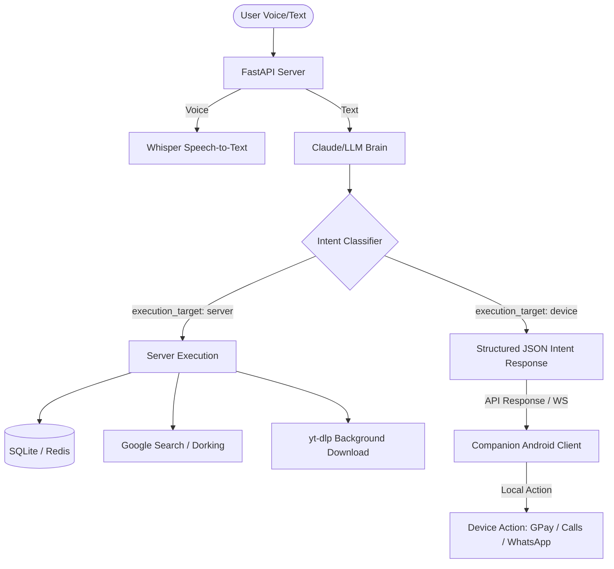

# Repository Context: Jarvis VPS Core

`Jarvis VPS Core` is a headless, voice-activated AI assistant backend designed to run on a Linux VPS. It acts as the centralized "brain" of the assistant, delegating actions between server-side execution (e.g., searches, database storage, downloads) and device-side execution (e.g., executing phone calls, WhatsApp messages, and UPI payments on a companion Android app via AccessibilityService/Intents).

---

## 1. Architectural Architecture & Design


- **Headless VPS ("The Brain")**: Listens for text/voice inputs, performs processing, performs web/download tasks, generates Text-to-Speech (TTS) audio files, and tracks state/memories.
- **Android Companion App ("The Muscle")**: Consumes JSON payloads returned by the VPS API. If the execution target is `device`, the Android app uses local services (Accessibility, Telephony, or standard Android Intent bindings) to carry out actions.
- **Languages Supported**: Multilingual intent parsing and response translation including Hindi, English, Hinglish, Tamil, Telugu, Bengali, Marathi, Punjabi, Urdu, Kannada, and Malayalam.

---

## 2. Directory & Component Breakdown

```
jarvis/
├── actions/                  # Server-side tool execution handlers
│   ├── downloader.py         # Handles yt-dlp file/video downloading with WebSocket callbacks
│   ├── dork.py               # Google Dork query executor (requires confirmation)
│   └── search.py             # SerpAPI wrapper for Google Searches
├── api/
│   ├── models/               # Pydantic schema models for requests and responses
│   └── routes/               # FastAPI route definitions
│       ├── auth.py           # JWT Authentication (/auth/login)
│       ├── command.py        # Core processing endpoints (/command/text, /command/voice, /command/confirm)
│       ├── contacts.py       # Address book endpoints (/contacts)
│       ├── downloads.py      # Download manager endpoints (/downloads)
│       ├── health.py         # System health/resource utilization (/health)
│       ├── memory.py         # Key-value memory store (/memory)
│       └── timers.py         # Alarm/timer manager (/timers)
├── audio_cache/              # Temp storage for Whisper inputs and generated TTS output files
├── data/                     # Holds the primary SQLite sqlite3 database file
├── auth.py                   # Token encode/decode logic and FastAPI dependencies
├── brain.py                  # System Prompts, intent contracts, and Anthropic/OpenAI/Gemini/Groq router
├── config.py                 # Central config manager; validates environment configs
├── memory.py                 # SQLite schema, WAL settings, and Redis caching helpers
├── server.py                 # Entry point. Sets up FastAPI, middleware, static routing, and WebSockets
└── voice.py                  # STT (Whisper model) and TTS (ElevenLabs / pyttsx3 offline fallback)
```

---

## 3. Database Schema (`memory.py`)
Persisted using **SQLite (WAL mode)** via `aiosqlite`. Caching, rate-limiting, and short-term session state are held in **Redis**.

```sql
-- Per-session chat history
CREATE TABLE IF NOT EXISTS conversations (
    id          INTEGER PRIMARY KEY AUTOINCREMENT,
    session_id  TEXT    NOT NULL,
    timestamp   TEXT    NOT NULL DEFAULT (strftime('%Y-%m-%dT%H:%M:%SZ','now')),
    role        TEXT    NOT NULL CHECK(role IN ('user','assistant','system')),
    content     TEXT    NOT NULL,
    language    TEXT    DEFAULT 'en',
    action      TEXT
);

-- Key/Value facts taught to Jarvis (e.g., 'favorite_color', 'dad_phone')
CREATE TABLE IF NOT EXISTS facts (
    id          INTEGER PRIMARY KEY AUTOINCREMENT,
    key         TEXT    NOT NULL UNIQUE,
    value       TEXT    NOT NULL,
    created_at  TEXT    NOT NULL DEFAULT (strftime('%Y-%m-%dT%H:%M:%SZ','now')),
    updated_at  TEXT    NOT NULL DEFAULT (strftime('%Y-%m-%dT%H:%M:%SZ','now'))
);

-- Address book mapping names to phone numbers and UPI IDs
CREATE TABLE IF NOT EXISTS contacts (
    id          INTEGER PRIMARY KEY AUTOINCREMENT,
    name        TEXT    NOT NULL,
    phone       TEXT,
    whatsapp    INTEGER NOT NULL DEFAULT 0,
    upi_id      TEXT,
    created_at  TEXT    NOT NULL DEFAULT (strftime('%Y-%m-%dT%H:%M:%SZ','now'))
);

-- Download history tracking
CREATE TABLE IF NOT EXISTS downloads (
    id              INTEGER PRIMARY KEY AUTOINCREMENT,
    url             TEXT    NOT NULL,
    filename        TEXT    NOT NULL,
    filetype        TEXT    NOT NULL DEFAULT 'file',
    status          TEXT    NOT NULL DEFAULT 'pending' CHECK(status IN ('pending','downloading','completed','failed')),
    progress        REAL    NOT NULL DEFAULT 0.0,
    file_size_mb    REAL    DEFAULT 0.0,
    created_at      TEXT    NOT NULL DEFAULT (strftime('%Y-%m-%dT%H:%M:%SZ','now')),
    completed_at    TEXT
);

-- Audit logs for every classified intent mapping to success/error status
CREATE TABLE IF NOT EXISTS intent_log (
    id               INTEGER PRIMARY KEY AUTOINCREMENT,
    session_id       TEXT    NOT NULL,
    timestamp        TEXT    NOT NULL DEFAULT (strftime('%Y-%m-%dT%H:%M:%SZ','now')),
    action           TEXT    NOT NULL,
    execution_target TEXT    NOT NULL DEFAULT 'server',
    params_json      TEXT,
    success          INTEGER NOT NULL DEFAULT 1,
    error_msg        TEXT
);
```

---

## 4. API & Intent Contracts

### Command Interface (`/command/text` and `/command/voice`)
Every input processed through `brain.py` returns a unified JSON format mapping to a device action or server-side task.

#### **Response Intent Contract**
```json
{
  "success": true,
  "session_id": "abc123xyz",
  "language": "hi-en",
  "transcribed_text": "Rahul ko 500 rupay bhejo",
  "response_text": "Rahul ko GPay se ₹500 bhej raha hun",
  "response_audio_url": "/audio/tts_abc123.wav",
  "execution_target": "device",
  "intent": {
    "action": "upi_payment",
    "app": "gpay",
    "params": {
      "contact": "Rahul",
      "amount": 500
    },
    "confirmation_required": true,
    "confirmation_message": "GPay se Rahul ko ₹500 bhejna hai. Confirm karein?"
  }
}
```

### Confirmation Endpoint (`/command/confirm`)
If `confirmation_required` is `true` in the initial intent payload, the client must ask the user for confirmation and send the result to:
- **Endpoint**: `POST /command/confirm`
- **Request Body**:
  ```json
  {
    "session_id": "abc123xyz",
    "confirmed": true,
    "dork_query": "optional dork string if executing search",
    "download_url": "optional download URL if starting restricted file download"
  }
  ```

---

## 5. Intent Action Registry

### **Server-Side Actions (`execution_target: "server"`)**
*Processed entirely on the VPS:*
1. **`google_search`** — Search the web via SerpAPI.
   - Params: `{"query": str, "num_results": int}`
2. **`google_dork`** — Special file search (requires confirmation).
   - Params: `{"user_intent": str}`
3. **`download_file`** / **`download_video`** — Trigger background downloading via `yt-dlp`. Pushes progress in real-time over WebSocket.
   - Params: `{"url": str}`
4. **`remember_fact`** — Save key-value fact into `facts` table.
   - Params: `{"key": str, "value": str}`
5. **`recall_fact`** — Query fact.
   - Params: `{"key": str}`
6. **`list_facts`** — Fetch list of all facts.
7. **`system_info`** — Fetch host system status.
8. **`get_weather`** — Fetch current temperature and forecast.
   - Params: `{"city": str}`
9. **`clarify`** — Used when the intent is ambiguous.
   - Params: `{"question": str}`

### **Device-Side Actions (`execution_target: "device"`)**
*Sent to the Android companion client for execution:*
1. **`send_whatsapp`** — Send text message. (App: `whatsapp`)
   - Params: `{"contact": str, "message": str, "phone": str}`
2. **`make_call`** — Dial a number. (App: `dialer`)
   - Params: `{"contact": str, "phone_number": str}`
3. **`send_sms`** — Send standard SMS. (App: `messages`)
   - Params: `{"contact": str, "phone_number": str, "message": str}`
4. **`upi_payment`** — Make money transfer. (App: `gpay`/`phonepe`/`paytm`)
   - Params: `{"contact": str, "amount": int, "upi_id": str, "note": str}`
5. **`open_app`** — Launches an app on the phone. (App: package name string)
   - Params: `{"app_name": str}`
6. **`set_timer`** / **`set_alarm`** — System clock manipulation. (App: `clock`)
   - Params: `{"duration_seconds": int, "label": str}` or `{"time_24h": str, "label": str, "days": [str]}`
7. **`open_url`** — Launch Web Browser. (App: `browser`)
   - Params: `{"url": str}`
8. **`youtube_search`** / **`spotify_search`** — Media search. (App: `youtube`/`spotify`)
   - Params: `{"query": str}`

---

## 6. Real-Time Updates (WebSockets)
- **URI**: `/ws/{session_id}?token=<jwt>`
- Client keeps this active to capture push messages regarding:
  - Downloader status (progress metrics, speed, estimated size, download finished triggers).
  - Background dorking results and notification alerts.
